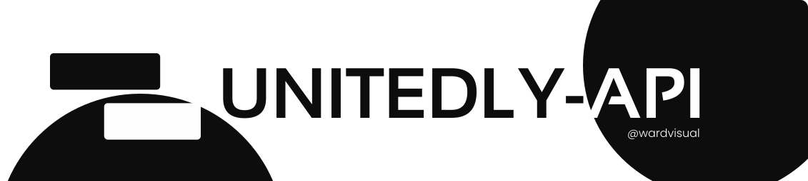

<div id="top"></div>

<!-- [![Contributors][contributors-shield]][contributors-url]
[![Forks][forks-shield]][forks-url]
[![Stargazers][stars-shield]][stars-url]
[![Issues][issues-shield]][issues-url]
[![MIT License][license-shield]][license-url]
[![LinkedIn][linkedin-shield]][linkedin-url] -->

<!-- PROJECT LOGO -->
<br />
<div align="center">
  <a href="https://github.com/wardvisual/unitedly-api">
    
  </a>

  <h3 align="center">Unitedly-API</h3>

  <p align="center">
   A Unitedly-API is a collection of an API that uses a third-party API to produce a Unitedly-API. This project was built on top of the ReactJS framework, which was NextJS. Unitedly-API aims to provide a curated list of free APIs with an elegant user interface.
    <br />
    <br />
    <a href="https://github.com/wardvisual/unitedly-api"><strong>View Project »</strong></a>
    <br />
    <br />
    <a href="https://github.com/wardvisual/unitedly-api">View Demo</a>
    ·
    <a href="https://github.com/wardvisual/unitedly-api/issues">Report Bug</a>
    ·
    <a href="https://github.com/wardvisual/unitedly-api/issues">Request Feature</a>
  </p>
</div>

### Built With

Technologies and Tools that this project used.

- [Next.js](https://nextjs.org/)
- [Typescript](https://www.typescriptlang.org/)
- [VSCode](https://code.visualstudio.com/)

<!-- INSTALLATION -->

### Installation

This project was restricted to only using NPM.

1. Clone the repo
   ```sh
   git clone https://github.com/wardvisual/unitedly-api.git
   ```
2. Install NPM packages
   ```sh
   npm install
   ```

<!-- CONTACT -->

## Contact

Edward Fernandez - [@wardvisual](https://twitter.com/wardvisual)
Project Link: [Unitedly-API](https://github.com/wardvisual/unitedly-api)

<!-- ACKNOWLEDGMENTS -->

## Acknowledgments

A special thanks to api.publicapis.org for this wonderful list of apis.

- [Public APIs](https://api.publicapis.org)

<p align="right">(<a href="#top">back to top</a>)</p>
